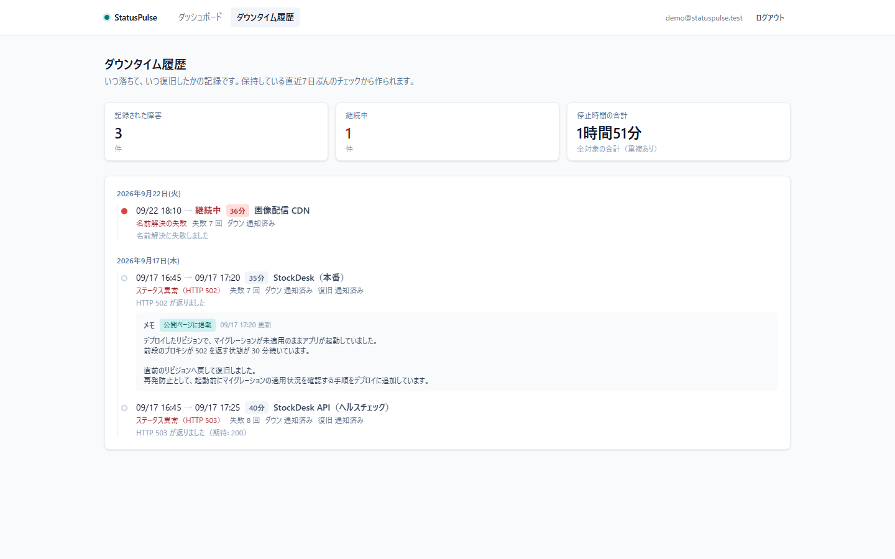
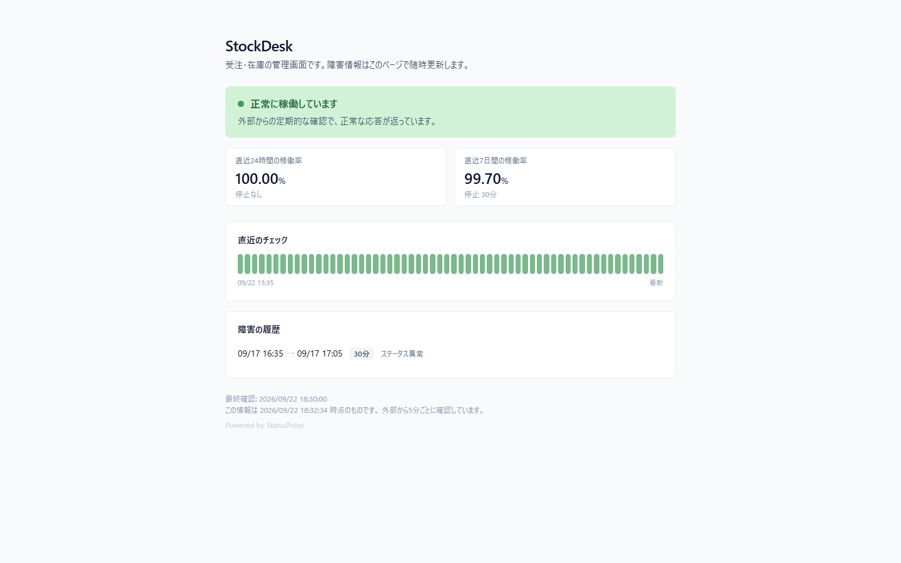
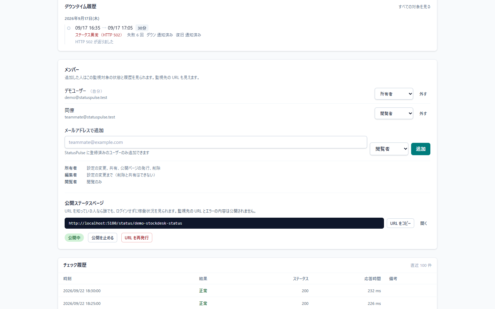

# StatusPulse

複数の Web サイト / API の死活を定期的に確認し、稼働率を記録する監視ツール。個人開発者〜小規模チームが、自分のサービス群の状態をひとつの画面で把握するためのもの。

**Phase 3 完了。** 監視対象の登録と Cloudflare Workers による定期チェック（Phase 1）、ダウンタイム履歴・連続N回失敗での判定・Slack 通知（Phase 2）、公開ステータスページとチームでの共有（Phase 3）が動作する。

---

## 画面

### ダッシュボード

異常なものを常に最上段に置く。稼働率の数字だけでは「いつ落ちたか」が分からないので、直近のチェック結果を帯で並べている。99.5% という値は、1回の長い障害でも、細かい失敗の散らばりでも同じになる。


### ダウンタイム履歴

いつ落ちて、いつ復旧したかを期間として記録する。通知を送ったかどうかも並べてあり、「通知が来なかった」ときに送っていないのか届いていないのかを切り分けられる。



### 公開ステータスページ

URL を知っている人なら誰でも、ログインせずに見られます。**監視先の URL もエラーの本文も、このページには出しません。**



### 共有の設定

メンバーの追加と役割の変更、公開ページの発行をここで行います。URL の再発行を「公開停止」と別の操作にしてあるのは、止めるだけでは再開時に同じ URL が生き返るためです。



### 監視対象の登録

設定項目にはすべて「何のための値か」を添えている。連続失敗回数を選ぶと、その場で「検知が最大 N 分遅れる」と出る。閾値は大きいほど安全な設定ではないので、トレードオフを選ぶ時点で数字にしている。


### 監視対象の詳細

その対象のダウンタイム履歴と、1回ごとのチェック結果を並べる。失敗は**種類**（タイムアウト / 名前解決 / 証明書 / ステータス異常）まで残す。「落ちている」と一口に言っても、打つ手がそれぞれ違う。


---

## 何を解決するのか

自分でデプロイしたサービスが落ちたとき、それに気付くのはたいてい**自分が使おうとしたとき**になる。外形監視のサービスを使えばよいが、監視したいのが個人開発の数サイトだと、そのためにアカウントを増やして料金体系を調べるほどでもない、という状態で放置されやすい。

StatusPulse が引き受けるのは次の2つ。

1. **落ちたことに気付く** — ブラウザを開いていなくても、定期的に外から叩き続ける
2. **どれくらい落ちていたかを記録する** — 「なんとなく不安定」を数字にする

設計上いちばん気をつけたのは、**このツール自身が嘘をつかないこと**。監視ツールが「異常なし」と表示していれば、人はそれ以上確かめない。だから「データが取れていない」状態を「正常」と区別できない表示にしない、稼働率を良い方向に丸めない、といった判断を全体に通している。

---

## 技術スタック

| 領域            | 採用                                |
| --------------- | ----------------------------------- |
| フロントエンド  | React 18 + TypeScript + Vite        |
| スタイリング    | Tailwind CSS v4                     |
| データ取得      | TanStack Query                      |
| フォーム / 検証 | React Hook Form + zod               |
| DB / 認証       | Supabase（PostgreSQL + Auth + RLS） |
| 定期処理        | Cloudflare Workers + Cron Triggers  |
| 通知            | Slack Incoming Webhook              |
| テスト          | Vitest                              |

### なぜ Next.js ではなく Vite なのか

Phase 1 の画面は**認証の内側だけで動く**管理画面で、公開ページも SEO も OGP も要らない。加えて本システムは権限の境界を DB の RLS に置き、独自の API サーバーを持たない構成を採っている。Next.js の Route Handlers に認可を書くなら境界が二重化する。サーバーが必要な唯一の部分（定期実行）は Cloudflare Workers が担当する。

結果として、静的ビルドを CDN に置くだけで完結する Vite が構成として最も単純になる。

**Phase 3 でこの判断の前提が一部崩れた。** 公開ステータスページは認証の外側にあり、OGP と初期表示速度が意味を持つ画面になる。それでも Vite のままにしたのは、崩れたのが1画面ぶんだけだったため。この1画面のために全体を移すより、必要になった時点で Workers 側で HTML を返すか、OGP 画像だけを生成する方が小さく収まると判断した（[`docs/decisions.md`](./docs/decisions.md) の判断 14）。

### なぜ定期処理が Cloudflare Workers なのか

ブラウザを開いている間しか動かない仕組みは、そもそも監視にならない。一方で、この規模のために常駐サーバーを立てて運用する理由もない。

Cron Triggers は「サーバーを持たずに定期実行だけを得る」ための最小の手段で、世界中のエッジから実行されるため監視元が1か所に固定されない利点もある。

---

## セットアップ

必要なもの: Node.js 22 以上 / pnpm 10 以上 / Docker（ローカル Supabase 用）

```bash
pnpm install
pnpm db:start      # ローカル Supabase を起動（初回は Docker イメージの取得に時間がかかる）
pnpm db:reset      # マイグレーション適用 + シード投入
```

`pnpm db:start` が出力する API URL と anon key を `apps/web/.env` に書く。

```
VITE_SUPABASE_URL=http://127.0.0.1:54421
VITE_SUPABASE_ANON_KEY=<anon key>
```

ポートが Supabase の既定（54321〜）ではなく 54421〜 なのは意図的で、`supabase/config.toml` でずらしてある。このツールは自分の他のサービスを監視するためのもので、**監視対象のローカル環境と同時に立ち上げる**場面が前提になる。既定のままだと `port is already allocated` で片方が起動できない。

```bash
pnpm dev           # http://localhost:5173
```

シードは demo@statuspulse.test / demo-password でログインできる。チーム機能の見え方を確かめるための2人目（teammate@statuspulse.test / demo-password）も入っていて、StockDesk（本番）に閲覧者として参加している。公開ステータスページは `/status/demo-stockdesk-status` で開く。**監視対象の1つ目は StockDesk のデプロイ先**で、URL は差し替え用のプレースホルダ（`https://stockdesk.example.com/`）になっている。実際のデプロイ先に変更して使う。

シードは7日ぶんのチェック履歴（障害2回、継続中の障害1件を含む）を生成する。数時間ぶんのデータでは 7日間の稼働率が 24時間の稼働率と同じ値になり、2つ並べる意味が見えない。開発用データは「機能を実演できるだけの期間と量」を持っている必要がある。

### Supabase を立てずに画面だけ見る

```bash
pnpm dev:mock
```

生成したダミーデータで動作する。デモとスクリーンショット、および初見の人の動作確認のためのモード。差し替えの境界は [`apps/web/src/lib/data-source.ts`](./apps/web/src/lib/data-source.ts) の1枚に閉じてあり、画面のコードはどちらのモードで動いているかを知らない。

判定と集計はモックでも本番と同じ `@statuspulse/core` を通る。モック側が稼働率を独自に計算すると、モックで確かめた意味が無くなる。

### 定期処理を動かす

```bash
cd apps/cron
cp ../../.env.example .dev.vars    # SUPABASE_URL と SUPABASE_SERVICE_ROLE_KEY を記入
pnpm dev                           # GET すると、その時点でチェックすべき対象を1巡する
```

service_role キーは `wrangler secret put SUPABASE_SERVICE_ROLE_KEY` で登録し、ファイルには置かない。このキーは RLS を迂回できるため、ブラウザ側の環境変数には絶対に設定しない。Slack の Webhook URL も同じ（URL 自体が送信権限そのもの）。

```bash
pnpm --filter @statuspulse/cron exec wrangler secret put SLACK_WEBHOOK_URL
```

未設定でも動く。その場合は送信せず、本文をログに出して「未送信」として記録する。

### よく使うコマンド

| コマンド         | 内容                               |
| ---------------- | ---------------------------------- |
| `pnpm dev`       | 開発サーバー                       |
| `pnpm dev:mock`  | Supabase 無しで画面を動かす        |
| `pnpm test`      | 判定ロジックのテスト               |
| `pnpm typecheck` | 全パッケージの型チェック           |
| `pnpm build`     | 本番ビルド                         |
| `pnpm db:reset`  | DB を作り直してシード投入          |
| `pnpm db:types`  | スキーマから TypeScript 型を再生成 |

---

## ディレクトリ構成

```
statuspulse/
├─ apps/
│  ├─ web/                     React + Vite の画面
│  │  └─ src/
│  │     ├─ components/        画面共通の部品（ui / AppShell / 状態バッジ）
│  │     ├─ features/          機能ごとの垂直分割
│  │     │  ├─ auth/
│  │     │  ├─ dashboard/      一覧と稼働率
│  │     │  ├─ incidents/      ダウンタイムのタイムライン
│  │     │  ├─ monitors/       登録・編集・詳細
│  │     │  ├─ sharing/        メンバーと公開ページの設定
│  │     │  └─ status/         公開ステータスページ（認証の外側）
│  │     └─ lib/               Supabase クライアント、データ取得の境界、モック
│  └─ cron/                    Cloudflare Workers（毎分起動 → チェック → Slack 通知）
├─ packages/
│  └─ core/                    判定ロジック・型・zod スキーマ（テストはここに集中）
├─ supabase/
│  ├─ migrations/              スキーマ / RPC 関数・ビュー / RLS
│  └─ seed.sql                 ローカル開発用データ（7日ぶんの履歴を生成）
└─ docs/
   ├─ schema.md                テーブル設計と権限の詳細
   └─ decisions.md             設計判断の記録
```

`packages/core` に判定ロジックを切り出したのは、**DB も Worker も React も起動せずに検証できる状態を保つため**。このツールで最も壊れてはいけないのはダウン判定と稼働率の計算で、そこを往復の遅い E2E ではなく高速な単体テストで押さえられる。画面（web）と定期処理（cron）が同じ規則を共有できる利点もある。

---

## 監視の仕組み

### 観測と判定を分ける

設計の芯はここにある。

|      | 置き場所                  | 性格                                  |
| ---- | ------------------------- | ------------------------------------- |
| 観測 | `checks.result`           | 1回のリクエストが成功したか。**事実** |
| 判定 | `monitors.current_status` | その対象を今どう扱うか。**解釈**      |

判定の規則は運用しながら必ず変わる。一方、観測は事実なので後から変わらない。変わるものと変わらないものを同じ列に載せない。

この分離が実際に効いたのが Phase 2 で、「連続N回失敗でダウン」の導入は `monitors.failure_threshold` の既定値を変えるだけで済んだ。判定関数は Phase 1 の時点から閾値を引数に取る形で書いてあり、テストも閾値3の場合を含めて通してあった。

状態は3値（`unknown` / `up` / `down`）。**`unknown` を持つのは、登録直後の対象を `down` と表示しないため。** 「まだ確かめていない」と「確かめたら落ちていた」は別の事実で、前者を赤で出すと URL の打ち間違いと本当の障害が区別できない。

### 誰をいつチェックするか

Cron Triggers は `* * * * *`（毎分）の**1本だけ**にして、間隔の判定は DB 側の `due_monitors()` が行う。

間隔ごとに cron 式を分ける方法も考えたが、それだと監視対象の間隔を変えるたびに Worker を再デプロイすることになる。画面から変えられる設定が、実際にはデプロイなしでは反映されない状態になってしまう。

due 判定は**半周期（30秒）ぶん早めてある**。Cron の起動時刻には数秒のぶれがあり、厳密に比較すると 1分間隔の対象で経過が 59.4 秒になった回が飛ばされ、実質2分間隔として動いてしまう。ごく稀に間隔が詰まる方が、設定より粗くなるより望ましい。

`last_checked_at` は成否にかかわらず更新する。失敗時に更新しないと、落ちている対象だけが毎分チェックされ続ける（最も負荷をかけたくない相手に、最も多くリクエストを送ることになる）。

---

## 稼働率の定義

```
稼働率 = 1 − 停止していた時間 ÷ 監視できていた期間
```

Phase 1 はチェック回数ベース（成功回数 ÷ 実行回数）だった。ダウンの**期間**を持つ `incidents` ができた Phase 2 で、時間ベースへ移した（[`docs/decisions.md`](./docs/decisions.md) の判断 20）。

回数ベースは「チェックの 0.5% が失敗した」という意味しか持たず、他のサービスが出す稼働率と比較できない。「停止 37分」と書ける方が影響の大きさがそのまま伝わる。画面では両方を並べている。

集計期間は監視対象の年齢で頭打ちにする。登録して1時間の対象を24時間で割ると、稼働率が常に 95% 台に見えてしまう。

**この定義でも残る弱点を隠さない。** どちらの定義も「監視できていた時間」の話でしかない。定期処理そのものが止まっていれば、その間の障害は `incidents` にも `checks` にも現れず、**実態より良い数字が出る**。

そこで期待されるチェック回数（期間 ÷ 間隔）と実測回数を突き合わせ、9割を下回ったら稼働率の隣に警告を出す。

### 表示は必ず切り捨てる

10000 回中 1 回落ちていれば 99.99% だが、小数第1位で四捨五入すると 100.0% になる。**落ちた事実があるのに 100% と表示される**のは、稼働率という数字への信頼そのものを損なう。100% と表示するのは停止が1秒も無かったときだけにしてある。

この種の数字は「良く見せない」方向に倒す。悪い方向の誤差は利用者が確認しに行くだけだが、良い方向の誤差は見過ごされる。同じ理由で、インシデントの終了時刻には「復旧を**確認した**時刻」を採っている（最後の失敗と最初の成功の間は、ダウン側に数える）。

---

## ダウンタイムの記録と通知（Phase 2）

### 誤検知を減らす — 連続N回失敗での判定

`failure_threshold` 回連続で失敗したときだけ「異常」と判定する。既定は 2。

閾値は大きいほど安全な設定ではない。**検知の遅れが「間隔 × (N−1)」まで伸びる**ので、1時間間隔の対象を 3 にすると最大2時間気付けない。設定画面では選択と同時に遅れの最大値を表示し、通知本文にも「2回連続で失敗（最大 10分 の検知遅れ）」と書いている。

**インシデントの開始時刻は「最初に失敗した時刻」**にする。判定が確定するのは N 回目だが、実際に落ちていたのは1回目から。判定時刻を起点にすると、誤検知を減らすための設定が稼働率を良く見せる方向に働いてしまう。

### 通知の冪等性

Cron は同じ時刻に二度走ることがあり、手動実行や再デプロイでも重複しうる。同じ障害を何度も Slack に流すと、受け取る側は通知を見なくなる。

そこで `notifications` テーブルに「何を送ったか」を記録し、送る前に `claim_notification()` で宣言する。`insert ... on conflict do nothing` の結果で判定するので、同時に複数の Worker が走っても片方しか通知しない。判定と記録を別のクエリに分けると、その隙間で両方が「まだ送っていない」と判断しうる。

**重複判定の鍵は incident の ID から作る。** 「前回実行時刻からの差分」を時刻で追う方式は、実行が飛んだときに取りこぼし、二度走ったときに重複する。障害そのものに紐づく鍵なら、いつ何度走っても結果が同じになる。

**送信より先に記録する。** 逆にすると、送信成功後に記録へ失敗したときに二重送信になる。先に記録すると送信失敗時に通知が欠けるが、欠けたことは `status = 'failed'` として画面に残るので、黙って消えることはない。

### 復旧も必ず通知する

ダウンの通知だけを流すと、Slack を見ても「まだ落ちているのか、直ったのか」が分からない。障害対応で最も無駄が出るのは、すでに直っているものを追いかける時間になる。

一方、**落ち続けている間は沈黙する**。通知は状態が変わった回だけで、継続中は鳴らさない。

```bash
# Slack Webhook を登録する（未設定なら本文をログに出すだけで動く）
pnpm --filter @statuspulse/cron exec wrangler secret put SLACK_WEBHOOK_URL
```

---

## 公開ステータスページとチーム（Phase 3）

Phase 1 で引いた権限の境界（「所有者だけ」）を、ここで初めて張り替えた。広げる方向は2つあり、性格がまったく違う。

### 公開ページ — テーブルではなく関数を開く

匿名ユーザー（`anon`）に開いているのは `public_status(slug)` **1つだけ**で、テーブルは1枚も開いていない。

RLS のポリシーは**引数を取れない**。「公開中なら anon も読める」というポリシーを書くと、anon は公開中の監視対象を**全件列挙できて**しまい、他人の公開ページとその監視先 URL まで引ける。公開ページが公開情報であることと、公開ページの一覧が公開情報であることは別の話になる。

slug（22文字・約111ビット）は「知っていること自体が権限」として扱う。RLS は「この人が触れる行はどれか」を答える仕組みであって、「この鍵に対応する行はどれか」を答える仕組みではない。問いの形が違うものを、同じ仕組みで解こうとしない。

**このページで最も重要なのは、何を出すかではなく何を出さないか。**

| 出さないもの     | 理由                                               |
| ---------------- | -------------------------------------------------- |
| 監視先の URL     | `/health?token=...` のような経路が設定されうる     |
| エラーの本文     | スタックトレースや内部ホスト名が入りうる           |
| ステータスコード | 利用者の行動を変えないが、内部構成の手がかりになる |
| 監視対象の内部名 | 公開用のタイトルを別に持つ                         |
| 所有者・メンバー | 誰が運用しているかは公開情報ではない               |

TypeScript 側の型（`PublicStatus`）も、出してよいものだけの形にしてある。管理画面の型を流用すると、余計な項目を持ったまま公開画面へ渡す経路ができる。

**情報が古いときは「正常」と言い切らない。** 最終チェックから「間隔 × 3」を超えたら、`up` でも見出しを「状態を確認しています」に落とす。定期処理が止まっているのに「正常に稼働しています」と出し続けるのは、この画面で最も避けたい挙動になる。管理画面なら運用者が気付けるが、公開ページの読み手は気付けない。

**公開停止と URL の再発行は別の操作**にしてある。止めるだけでは、再開したときに同じ URL が生き返る。漏れた URL を無効にしたいなら slug そのものを変えるほかない。

### チーム — RLS の再帰を関数で断つ

役割は所有者 / 編集者 / 閲覧者の3段階。編集者に削除を許さないのは、監視対象の削除がチェック履歴とダウンタイムの記録を巻き添えにするため。設定の変更と同じ重さの操作ではない。

実装上の要点は再帰の回避になる。`monitors` のポリシーが `monitor_members` を参照し、`monitor_members` のポリシーが `monitors` を参照すると、評価が互いを呼び合って無限再帰する（Postgres は 42P17 で止める）。判定を SECURITY DEFINER 関数（`can_view_monitor()` など）に切り出すと、その関数は RLS を通過するので輪が切れる。

```sql
create policy monitors_select on monitors
  for select to authenticated
  using (can_view_monitor(id));
```

これらの関数は**引数に監視対象しか取らず、ユーザーは常に `auth.uid()` を見る**。任意のユーザーの役割を返す形にすると、RLS を迂回して他人の権限を調べる道具になる。SECURITY DEFINER 関数は、できることを最小にして初めて安全になる。

**最後の所有者は降格も削除もできない。** 所有者がいない監視対象は、共有設定も削除も誰にもできない状態になり、直す手段が DB を直接触ることしか残らない。操作できなくなる種類の事故は、起きてからでは戻せないので、DB 側（`assert_not_last_owner()`）に置いてある。

---

## データの保護

このツールが出す数字は「観測ログを誰も書き換えていない」ことの上に成り立っている。そこを DB 側で担保している。

- **`checks` に書き込みポリシーを作らない** — 観測ログへの書き込み経路は `record_check()`（SECURITY DEFINER）だけ
- **判定キャッシュ列を GRANT から外す** — `current_status` などをアプリから UPDATE できない。RLS は「どの行」しか決められないので、「どの列」は列単位の GRANT で決める
- **定期処理用の関数の EXECUTE を剥がす** — Postgres では関数の EXECUTE が既定で PUBLIC に付く。`due_monitors()` は SECURITY DEFINER で RLS を迂回するため、放置すると**他人の監視対象の URL が誰にでも返る**

加えて、監視対象の URL は入口で検証している。このツールは「利用者が入力した任意の URL にサーバー側からリクエストを送る」という SSRF そのものの形をしているため、`http` / `https` 以外、URL 内の認証情報、localhost・私有 IP・リンクローカルを弾く。詳細と、この検証で防げないこと（DNS リバインディング）は [`docs/decisions.md`](./docs/decisions.md) の判断 10 に書いた。

---

## テスト方針

テストは **ダウン判定・稼働率の計算・URL 検証**に絞っている。画面のスナップショットや CRUD の往復は、壊れたときの被害に対して維持コストが見合わないため書いていない。

```bash
pnpm test
```

| 対象               | 確認していること                                                               |
| ------------------ | ------------------------------------------------------------------------------ |
| 状態遷移           | 閾値1と閾値3、unknown からの遷移、途中で成功したときのカウント復帰、通知の起点 |
| チェック時刻の判定 | 許容幅の境界、無効化された対象、未チェックの対象                               |
| ステータス評価     | 2xx/3xx の境界、期待値を指定した場合                                           |
| 失敗の分類         | タイムアウト / DNS / TLS / ネットワーク、分類できない場合の扱い                |
| 稼働率（時間）     | 停止時間が期間を超えた場合、集計期間の頭打ち、停止時間の表記                   |
| 稼働率（回数）     | 0件のときに 0% ではなく未計測、切り捨て、評価の境界                            |
| ダウンタイム       | 期間をまたぐ障害の切り詰め、継続中の扱い、検知遅れの計算                       |
| 通知               | 重複を防ぐ鍵の性質、本文に出す情報、日本時間での表記、閾値による文面の変化     |
| 取りこぼしの検出   | 期待回数との比、1を超えないこと                                                |
| URL 検証           | 私有 IP の範囲の境界、認証情報、正規化（同じ対象が同じ文字列になること）       |

DB 側の不変条件は、ローカル Supabase に対して手で確認している。継続中インシデントは1本まで、観測ログは書き換え不能、定期処理用の関数は service_role 限定、`anon` からはテーブルにも判定用の関数にも触れない、閲覧者は設定を変更できない、最後の所有者は降格できない、など。Phase 4 でテスト用 DB に対する統合テストとして自動化する予定。

---

## 開発状況

- [x] **Phase 1** — 監視対象の登録、Cron による定期チェック、状態の色分け、24時間・7日間の稼働率
- [x] **Phase 2** — ダウンタイム履歴のタイムライン、連続N回失敗での判定、Slack 通知（送信前に記録して重複を防ぐ）、時間ベースの稼働率
- [x] **Phase 3** — 公開ステータスページ（認証不要）、チームでの共有と権限管理（所有者 / 編集者 / 閲覧者）
- [ ] **Phase 4** — SSL 証明書の期限チェック、レスポンス本文の文字列チェック、インシデントへのポストモーテム

設計判断の詳細は [`docs/decisions.md`](./docs/decisions.md)、スキーマの詳細は [`docs/schema.md`](./docs/schema.md) を参照。
