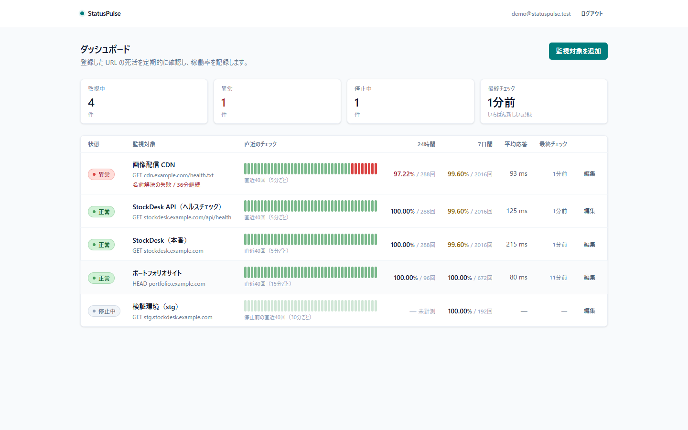
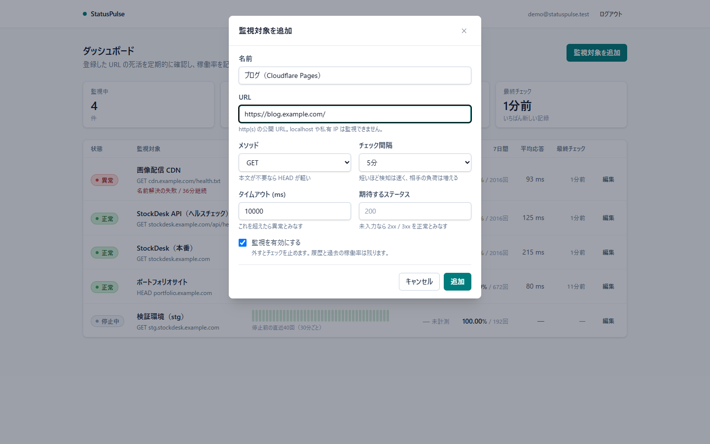
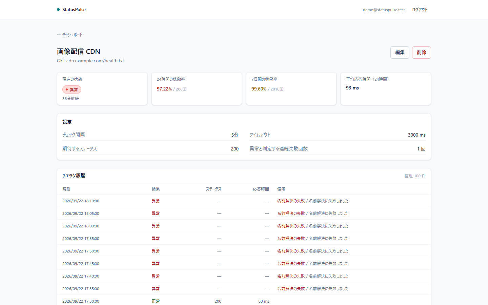

# StatusPulse

複数の Web サイト / API の死活を定期的に確認し、稼働率を記録する監視ツール。個人開発者〜小規模チームが、自分のサービス群の状態をひとつの画面で把握するためのもの。

**Phase 1 完了。** 監視対象の登録、Cloudflare Workers による定期チェック、状態の色分け表示、24時間・7日間の稼働率が動作する。

---

## 画面

### ダッシュボード

異常なものを常に最上段に置く。稼働率の数字だけでは「いつ落ちたか」が分からないので、直近のチェック結果を帯で並べている。99.5% という値は、1回の長い障害でも、細かい失敗の散らばりでも同じになる。



### 監視対象の登録

設定項目にはすべて「何のための値か」を添えている。チェック間隔を選択式にしているのは、Cron が1分ごとにしか起動しないため（自由入力にすると「設定したのに守られない」設定ができる）。



### 監視対象の詳細

チェック履歴は失敗の**種類**（タイムアウト / 名前解決 / 証明書 / ステータス異常）まで残す。「落ちている」と一口に言っても、打つ手がそれぞれ違う。



---

## 何を解決するのか

自分でデプロイしたサービスが落ちたとき、それに気付くのはたいてい**自分が使おうとしたとき**になる。外形監視のサービスを使えばよいが、監視したいのが個人開発の数サイトだと、そのためにアカウントを増やして料金体系を調べるほどでもない、という状態で放置されやすい。

StatusPulse が引き受けるのは次の2つ。

1. **落ちたことに気付く** — ブラウザを開いていなくても、定期的に外から叩き続ける
2. **どれくらい落ちていたかを記録する** — 「なんとなく不安定」を数字にする

設計上いちばん気をつけたのは、**このツール自身が嘘をつかないこと**。監視ツールが「異常なし」と表示していれば、人はそれ以上確かめない。だから「データが取れていない」状態を「正常」と区別できない表示にしない、稼働率を良い方向に丸めない、といった判断を全体に通している。

---

## 技術スタック

| 領域            | 採用                                |
| --------------- | ----------------------------------- |
| フロントエンド  | React 18 + TypeScript + Vite        |
| スタイリング    | Tailwind CSS v4                     |
| データ取得      | TanStack Query                      |
| フォーム / 検証 | React Hook Form + zod               |
| DB / 認証       | Supabase（PostgreSQL + Auth + RLS） |
| 定期処理        | Cloudflare Workers + Cron Triggers  |
| テスト          | Vitest                              |

### なぜ Next.js ではなく Vite なのか

Phase 1 の画面は**認証の内側だけで動く**管理画面で、公開ページも SEO も OGP も要らない。加えて本システムは権限の境界を DB の RLS に置き、独自の API サーバーを持たない構成を採っている。Next.js の Route Handlers に認可を書くなら境界が二重化する。サーバーが必要な唯一の部分（定期実行）は Cloudflare Workers が担当する。

結果として、静的ビルドを CDN に置くだけで完結する Vite が構成として最も単純になる。

**この判断が変わる条件は明確にしてある。** Phase 3 の公開ステータスページは認証不要で外部に共有される画面なので、OGP と初期表示速度が意味を持つ。ただしその1画面のために全体を移すのは割に合わないので、まず Workers で補えないかを検討する（[`docs/decisions.md`](./docs/decisions.md) の判断 14）。

### なぜ定期処理が Cloudflare Workers なのか

ブラウザを開いている間しか動かない仕組みは、そもそも監視にならない。一方で、この規模のために常駐サーバーを立てて運用する理由もない。

Cron Triggers は「サーバーを持たずに定期実行だけを得る」ための最小の手段で、世界中のエッジから実行されるため監視元が1か所に固定されない利点もある。

---

## セットアップ

必要なもの: Node.js 22 以上 / pnpm 10 以上 / Docker（ローカル Supabase 用）

```bash
pnpm install
pnpm db:start      # ローカル Supabase を起動（初回は Docker イメージの取得に時間がかかる）
pnpm db:reset      # マイグレーション適用 + シード投入
```

`pnpm db:start` が出力する API URL と anon key を `apps/web/.env` に書く。

```
VITE_SUPABASE_URL=http://127.0.0.1:54421
VITE_SUPABASE_ANON_KEY=<anon key>
```

ポートが Supabase の既定（54321〜）ではなく 54421〜 なのは意図的で、`supabase/config.toml` でずらしてある。このツールは自分の他のサービスを監視するためのもので、**監視対象のローカル環境と同時に立ち上げる**場面が前提になる。既定のままだと `port is already allocated` で片方が起動できない。

```bash
pnpm dev           # http://localhost:5173
```

シードは demo@statuspulse.test / demo-password でログインできる。**監視対象の1つ目は StockDesk のデプロイ先**で、URL は差し替え用のプレースホルダ（`https://stockdesk.example.com/`）になっている。実際のデプロイ先に変更して使う。

シードは7日ぶんのチェック履歴（障害2回、継続中の障害1件を含む）を生成する。数時間ぶんのデータでは 7日間の稼働率が 24時間の稼働率と同じ値になり、2つ並べる意味が見えない。開発用データは「機能を実演できるだけの期間と量」を持っている必要がある。

### Supabase を立てずに画面だけ見る

```bash
pnpm dev:mock
```

生成したダミーデータで動作する。デモとスクリーンショット、および初見の人の動作確認のためのモード。差し替えの境界は [`apps/web/src/lib/data-source.ts`](./apps/web/src/lib/data-source.ts) の1枚に閉じてあり、画面のコードはどちらのモードで動いているかを知らない。

判定と集計はモックでも本番と同じ `@statuspulse/core` を通る。モック側が稼働率を独自に計算すると、モックで確かめた意味が無くなる。

### 定期処理を動かす

```bash
cd apps/cron
cp ../../.env.example .dev.vars    # SUPABASE_URL と SUPABASE_SERVICE_ROLE_KEY を記入
pnpm dev                           # GET すると、その時点でチェックすべき対象を1巡する
```

service_role キーは `wrangler secret put SUPABASE_SERVICE_ROLE_KEY` で登録し、ファイルには置かない。このキーは RLS を迂回できるため、ブラウザ側の環境変数には絶対に設定しない。

### よく使うコマンド

| コマンド         | 内容                               |
| ---------------- | ---------------------------------- |
| `pnpm dev`       | 開発サーバー                       |
| `pnpm dev:mock`  | Supabase 無しで画面を動かす        |
| `pnpm test`      | 判定ロジックのテスト               |
| `pnpm typecheck` | 全パッケージの型チェック           |
| `pnpm build`     | 本番ビルド                         |
| `pnpm db:reset`  | DB を作り直してシード投入          |
| `pnpm db:types`  | スキーマから TypeScript 型を再生成 |

---

## ディレクトリ構成

```
statuspulse/
├─ apps/
│  ├─ web/                     React + Vite の画面
│  │  └─ src/
│  │     ├─ components/        画面共通の部品（ui / AppShell / 状態バッジ）
│  │     ├─ features/          機能ごとの垂直分割
│  │     │  ├─ auth/
│  │     │  ├─ dashboard/      一覧と稼働率
│  │     │  └─ monitors/       登録・編集・詳細
│  │     └─ lib/               Supabase クライアント、データ取得の境界、モック
│  └─ cron/                    Cloudflare Workers（毎分起動して due な対象をチェック）
├─ packages/
│  └─ core/                    判定ロジック・型・zod スキーマ（テストはここに集中）
├─ supabase/
│  ├─ migrations/              スキーマ / RPC 関数・ビュー / RLS
│  └─ seed.sql                 ローカル開発用データ（7日ぶんの履歴を生成）
└─ docs/
   ├─ schema.md                テーブル設計と権限の詳細
   └─ decisions.md             設計判断の記録
```

`packages/core` に判定ロジックを切り出したのは、**DB も Worker も React も起動せずに検証できる状態を保つため**。このツールで最も壊れてはいけないのはダウン判定と稼働率の計算で、そこを往復の遅い E2E ではなく高速な単体テストで押さえられる。画面（web）と定期処理（cron）が同じ規則を共有できる利点もある。

---

## 監視の仕組み

### 観測と判定を分ける

設計の芯はここにある。

|      | 置き場所                  | 性格                                  |
| ---- | ------------------------- | ------------------------------------- |
| 観測 | `checks.result`           | 1回のリクエストが成功したか。**事実** |
| 判定 | `monitors.current_status` | その対象を今どう扱うか。**解釈**      |

判定の規則は運用しながら必ず変わる（Phase 2 で「連続N回失敗でダウン」に変える）。一方、観測は事実なので後から変わらない。変わるものと変わらないものを同じ列に載せない。

この分離があるので、Phase 2 の誤検知対策は `monitors.failure_threshold` の値を変えるだけで済む。判定関数は最初から閾値を引数に取る形で書いてあり、テストも閾値3の場合を含めて通してある。

状態は3値（`unknown` / `up` / `down`）。**`unknown` を持つのは、登録直後の対象を `down` と表示しないため。** 「まだ確かめていない」と「確かめたら落ちていた」は別の事実で、前者を赤で出すと URL の打ち間違いと本当の障害が区別できない。

### 誰をいつチェックするか

Cron Triggers は `* * * * *`（毎分）の**1本だけ**にして、間隔の判定は DB 側の `due_monitors()` が行う。

間隔ごとに cron 式を分ける方法も考えたが、それだと監視対象の間隔を変えるたびに Worker を再デプロイすることになる。画面から変えられる設定が、実際にはデプロイなしでは反映されない状態になってしまう。

due 判定は**半周期（30秒）ぶん早めてある**。Cron の起動時刻には数秒のぶれがあり、厳密に比較すると 1分間隔の対象で経過が 59.4 秒になった回が飛ばされ、実質2分間隔として動いてしまう。ごく稀に間隔が詰まる方が、設定より粗くなるより望ましい。

`last_checked_at` は成否にかかわらず更新する。失敗時に更新しないと、落ちている対象だけが毎分チェックされ続ける（最も負荷をかけたくない相手に、最も多くリクエストを送ることになる）。

---

## 稼働率の定義

```
稼働率 = 成功したチェック回数 ÷ 実行したチェック回数
```

**この定義の弱点を隠さない。** 分母は「実行できたチェック」しか数えないので、定期処理そのものが止まっていた時間は分母からも分子からも消える。その間に監視対象が落ちていても稼働率には表れず、**実態より良い数字が出る**。

監視ツールが黙って良い数字を出すのは最も避けたい挙動なので、期待されるチェック回数（期間 ÷ 間隔）と実測回数を突き合わせ、9割を下回ったら稼働率の隣に警告を出す。

時間ベースの稼働率（ダウンしていた期間の合計 ÷ 対象期間）の方が定義としては正しいが、それにはダウンタイムの「期間」を持つテーブルが要る。Phase 2 でダウンタイム履歴を作るときに移行する。

### 表示は必ず切り捨てる

10000 回中 1 回落ちていれば 99.99% だが、小数第1位で四捨五入すると 100.0% になる。**落ちた事実があるのに 100% と表示される**のは、稼働率という数字への信頼そのものを損なう。100% と表示するのは失敗が1回も無かったときだけにしてある。

この種の数字は「良く見せない」方向に倒す。悪い方向の誤差は利用者が確認しに行くだけだが、良い方向の誤差は見過ごされる。

---

## データの保護

このツールが出す数字は「観測ログを誰も書き換えていない」ことの上に成り立っている。そこを DB 側で担保している。

- **`checks` に書き込みポリシーを作らない** — 観測ログへの書き込み経路は `record_check()`（SECURITY DEFINER）だけ
- **判定キャッシュ列を GRANT から外す** — `current_status` などをアプリから UPDATE できない。RLS は「どの行」しか決められないので、「どの列」は列単位の GRANT で決める
- **定期処理用の関数の EXECUTE を剥がす** — Postgres では関数の EXECUTE が既定で PUBLIC に付く。`due_monitors()` は SECURITY DEFINER で RLS を迂回するため、放置すると**他人の監視対象の URL が誰にでも返る**

加えて、監視対象の URL は入口で検証している。このツールは「利用者が入力した任意の URL にサーバー側からリクエストを送る」という SSRF そのものの形をしているため、`http` / `https` 以外、URL 内の認証情報、localhost・私有 IP・リンクローカルを弾く。詳細と、この検証で防げないこと（DNS リバインディング）は [`docs/decisions.md`](./docs/decisions.md) の判断 10 に書いた。

---

## テスト方針

テストは **ダウン判定・稼働率の計算・URL 検証**に絞っている。画面のスナップショットや CRUD の往復は、壊れたときの被害に対して維持コストが見合わないため書いていない。

```bash
pnpm test
```

| 対象               | 確認していること                                                               |
| ------------------ | ------------------------------------------------------------------------------ |
| 状態遷移           | 閾値1と閾値3、unknown からの遷移、途中で成功したときのカウント復帰、通知の起点 |
| チェック時刻の判定 | 許容幅の境界、無効化された対象、未チェックの対象                               |
| ステータス評価     | 2xx/3xx の境界、期待値を指定した場合                                           |
| 失敗の分類         | タイムアウト / DNS / TLS / ネットワーク、分類できない場合の扱い                |
| 稼働率             | 0件のときに 0% ではなく未計測、切り捨て、評価の境界                            |
| 取りこぼしの検出   | 期待回数との比、1を超えないこと                                                |
| URL 検証           | 私有 IP の範囲の境界、認証情報、正規化（同じ対象が同じ文字列になること）       |

---

## 開発状況

- [x] **Phase 1** — 監視対象の登録、Cron による定期チェック、状態の色分け、24時間・7日間の稼働率
- [ ] **Phase 2** — ダウンタイム履歴のタイムライン、連続N回失敗での判定、Slack 通知（送信前に記録して重複を防ぐ）
- [ ] **Phase 3** — 公開ステータスページ、チームでの共有と権限管理
- [ ] **Phase 4** — SSL 証明書の期限チェック、レスポンス本文の文字列チェック、インシデントへのポストモーテム

設計判断の詳細は [`docs/decisions.md`](./docs/decisions.md)、スキーマの詳細は [`docs/schema.md`](./docs/schema.md) を参照。
